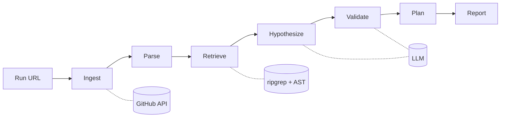

# ci-triage

Diagnose failing GitHub Actions runs with an LLM agent. Given a failed run URL, `ci-triage` pulls the logs, locates the failure in the source tree, and produces a ranked list of root-cause hypotheses with confidence scores and suggested fixes.

[](https://pypi.org/project/ci-triage/)
[](https://pypi.org/project/ci-triage/)
[](https://github.com/<owner>/ci-triage/actions)
[](LICENSE)

```
$ ci-triage analyze https://github.com/acme/widgets/actions/runs/1234567890

  Stage 1/6  Ingest      ✓  pulled 8.2 MB of logs, 12 recent commits
  Stage 2/6  Parse       ✓  assertion failure at tests/test_orders.py:84
  Stage 3/6  Retrieve    ✓  17 files, 2 recent diffs
  Stage 4/6  Hypothesize ✓  3 candidates
  Stage 5/6  Validate    ✓  scored against retrieved context
  Stage 6/6  Plan        ✓

  Top hypothesis (confidence 0.86)
    Fixture `mock_payment_gateway` was renamed to `payment_gateway_mock`
    in commit a3f1c2d but tests/test_orders.py:84 still references the
    old name.

    Suggested fix
      tests/test_orders.py:84
      - def test_order_charges_card(mock_payment_gateway):
      + def test_order_charges_card(payment_gateway_mock):

  See `ci-triage analyze --explain` for the full report.
```

## Installation

```bash
pip install ci-triage
```

Requires Python 3.11+ and [ripgrep](https://github.com/BurntSushi/ripgrep).

## Quick start

```bash
export ANTHROPIC_API_KEY=sk-ant-...
export GITHUB_TOKEN=ghp_...

ci-triage analyze <run-url>
```

The run URL is the page you land on when you click a failed check in a pull request — e.g. `https://github.com/<owner>/<repo>/actions/runs/<id>`.

## How it works

`ci-triage` runs a fixed six-stage pipeline. Each stage has a typed input and output, and every step is recorded to a local SQLite database for replay and debugging.



| Stage | What it does |
|---|---|
| **Ingest** | Fetches logs, workflow YAML, and recent commits via the GitHub API. |
| **Parse** | Extracts the failing file, line, and failure category from pytest output. |
| **Retrieve** | Collects the failing file, its import chain, and recent diffs using ripgrep and AST traversal. |
| **Hypothesize** | Generates structured root-cause candidates with the LLM, validated against a Pydantic schema. |
| **Validate** | Re-evaluates each hypothesis against the retrieved code and assigns a confidence score. |
| **Plan** | Produces a human-readable repair suggestion. `ci-triage` never modifies your code. |

## Configuration

Configuration is read from `pyproject.toml` under `[tool.ci-triage]`, or from `~/.config/ci-triage/config.toml`.

```toml
[tool.ci-triage]
model = "claude-sonnet-4-5"
max_context_files = 20
cache_dir = ".ci-triage-cache"
```

Environment variables:

| Variable | Purpose |
|---|---|
| `ANTHROPIC_API_KEY` | Required. API key for the LLM. |
| `GITHUB_TOKEN` | Required for private repos and to avoid rate limits. |
| `CI_TRIAGE_LOG_LEVEL` | `debug`, `info` (default), `warning`, `error`. |

## Commands

```
ci-triage analyze <run-url>         Diagnose a failed run
ci-triage replay <run-id>           Replay a previous diagnosis from local cache
ci-triage eval <suite>              Run the eval suite and print accuracy metrics
ci-triage --help
```

## Supported failures

Currently supports Python projects using pytest, for the following failure categories:

- Assertion failures
- Import errors
- Collection errors
- Unhandled exceptions

Other languages, test frameworks, and failure types are out of scope.

## Documentation

- [Architecture](docs/architecture.md)
- [Evaluation methodology](docs/evaluation.md)
- [Contributing](CONTRIBUTING.md)
- [Changelog](CHANGELOG.md)

## License

[MIT](LICENSE)
